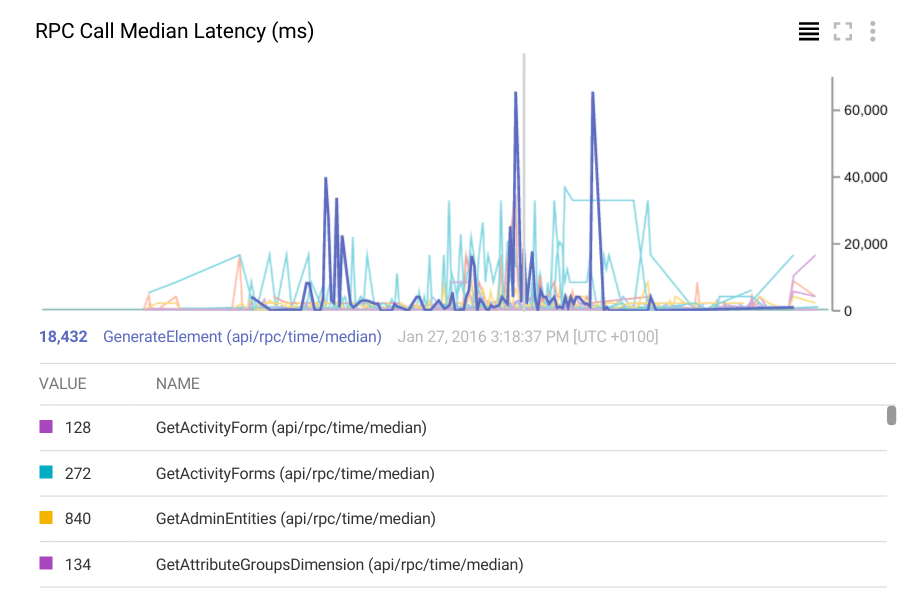

# AppEngine Metrics

Still-crude library to collect metrics across a set of AppEngine instances and 
report to Google Cloud Monitoring, inspired by [Dropwizard Metrics](https://github.com/dropwizard/metrics).

## Use Case

This library tries to fill a gap in the Cloud Monitoring offering for AppEngine users. For our application,
we wanted to be able to monitoring latency of specific RPC commands. To get this information across all instances
of the application, it's neccessary to first collect timings from across all running AppEngine instances, and then
periodically send the aggregate metrics to Cloud Monitoring as custom metrics.



## Design

The project includes an AppEngine module `statsd` which functions as a central collector for statistics from other
modules in the AppEngine application.

Statistics are reported from other modules 
using the [statsd message format](https://github.com/lukevenediger/statsd.net/blob/master/statsd.net/Documentation/reference/incoming-message-format.md)
over HTTP.

The Custom Metrics API does not appear to correctly support histogram values at this time, so the statsd module
computes and publishes the mean, median, and 95th percentile for each timer metric individually.

## Usage

First, you have to deploy the statsd module to your AppEngine project. You can do that by checking out this 
repository and updating the application-id in `statsd/src/main/webapp/WEB-INF/appengine-web.xml` to your own application,
and then running:

```
mvn appengine:update
```

Next, include the `metrics` library in your AppEngine project:

```.xml
<dependencies>
  <dependency>
    <groupId>com.bedatadriven</groupId>
    <artifactId>com.bedatadriven.appengine.metrics</artifactId>
    <version>0.4.2</version>
  </dependency>
<dependencies>

<repositories>
  <repository>
    <id>bedatadriven</id>
    <name>bedatadriven public repo</name>
    <url>https://nexus.bedatadriven.com/content/groups/public/</url>
  </repository>
</repositories>
```

You can then report metrics simply:

```.java

// increment a count
MetricsRegistry.INSTANCE.meter("your.metric.key", "your.kind").mark();

// update a timing histogram
MetricsRegistry.INSTANCE.timer("your.metric.key/time", "your.kind").update(elapsedMillis);
```

Custom metrics definitions will be created automatically as they are encountered.

For a complete example, see the `test/` web app.